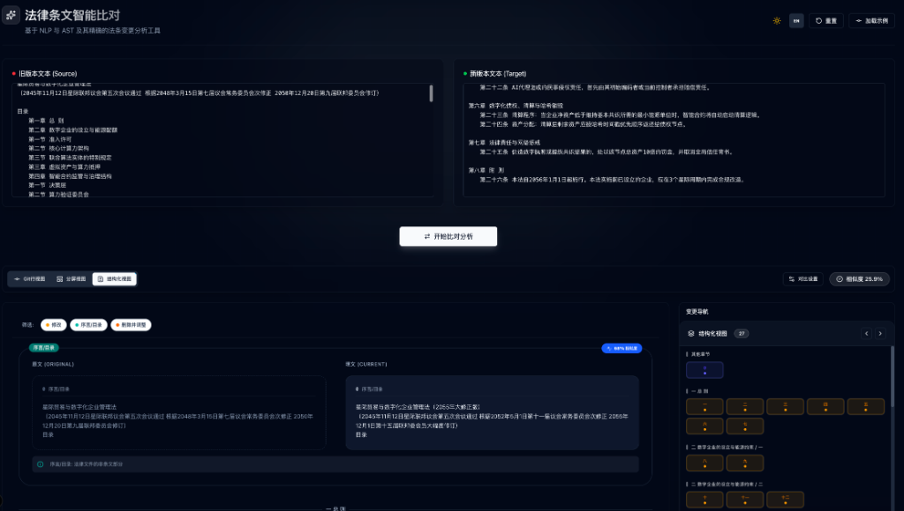

# Law Compare: Intelligent Legal Text Analysis Tool

[](LICENSE)
[](backend)
[](frontend)

An intelligent, high-performance tool for comparing legal documents and analyzing structural changes. Unlike generic diff tools, **Law Compare** understands the hierarchy of laws (Chapters, Sections, Articles, Clauses) and uses NLP to align content even when article numbers change.

[中文版本 (Chinese Version)](./README_CN.md)

**🌐 [Live Demo](https://law-diff.zeabur.app/)** - Try it out without installation!

---

## ✨ Key Features

- **Structural Diff**: Automatically identifies chapters, sections, and articles. It detects added, deleted, modified, and even merged/split articles.
- **Intelligent Alignment**: Uses weighted similarity algorithms (Jaccard + Containment + Semantic) to track moved or renumbered articles.
- **Multiple Views**:
  - **Structural View**: Tree-based visualization of changes across the entire document.
  - **Side-by-Side View**: Dual-pane comparison for focused reading.
  - **Git-style View**: Classic line-by-line diff for technical review.
- **High Performance**: Backend written in Rust with parallel processing and memory-efficient `Arc<str>` data sharing.
- **NER (Named Entity Recognition)**: Automatically detects dates, amounts, and legal terms within changes.

## 📸 Screenshots

| Structural Analysis | Side-by-Side Comparison |
|:---:|:---:|
|  |  |

| Git-style Line Diff |
|:---:|
|  |

---

## 🚀 Quick Start (Docker)

The easiest way to deploy Law Compare is using Docker with the included Caddy configuration.

```bash
# Clone the repository
git clone https://github.com/your-repo/law-compare.git
cd law-compare

# Build and run with Docker
docker build -t law-compare .
docker run -d -p 8080:80 law-compare
```

Access the application at `http://localhost:8080`.

---

## 🏗️ Architecture

- **Frontend**: Next.js 15+ with Tailwind CSS and Framer Motion for a premium, responsive UI.
- **Backend**: Rust (Axum) featuring:
  - **AST Parser**: Regex-based hierarchical parsing of legal documents.
  - **Aligner**: Multi-stage alignment logic to handle document evolution.
  - **Tokenizer**: Efficient Chinese segmentation using `jieba-rs`.
- **Proxy**: Caddy for efficient static file serving and API reverse proxying.

---

## 📖 Module Documentation

- [Backend Documentation](./backend/README.md)
- [Frontend Documentation](./frontend/README.md)
